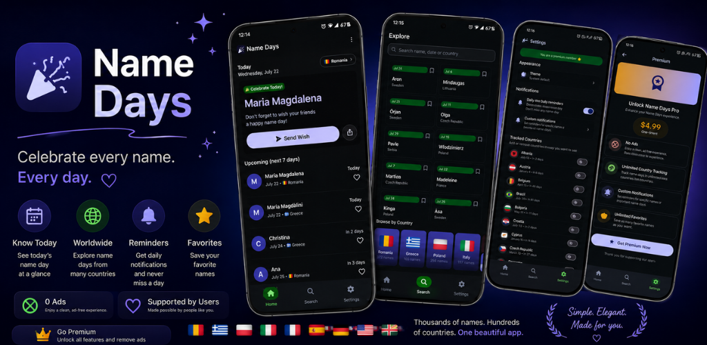
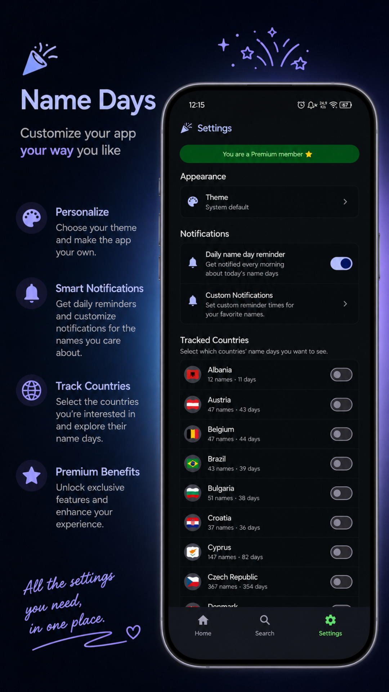
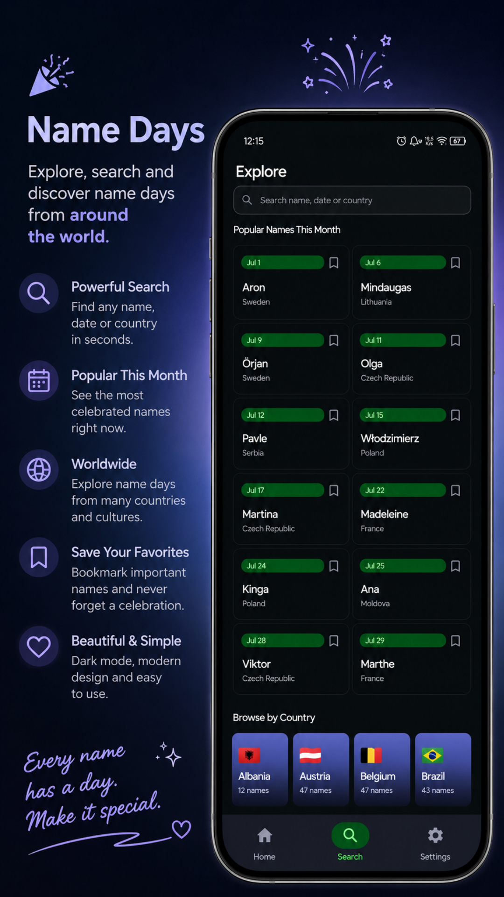
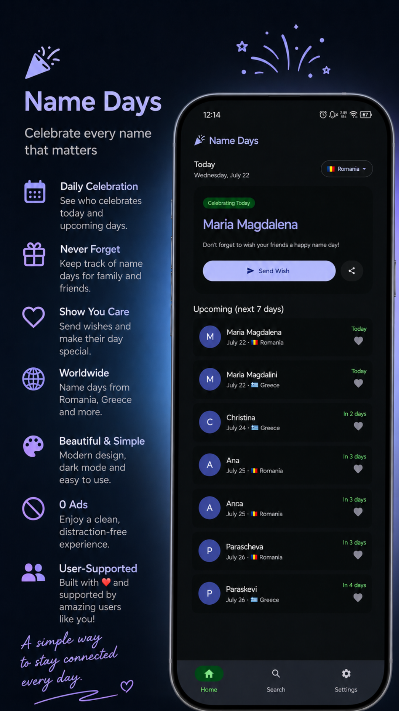
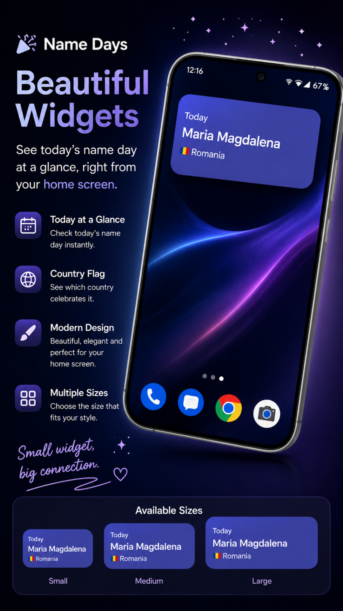

# 🎉 Name Days — Calendar

### Name-day calendars, reminders and traditions from around the world.

## Screenshots

---

## About

Name Days is a cheerful, ad-free Android calendar for local name-day traditions. It includes today’s names, country tracking, search, favorites, upcoming celebrations, sharing, a home-screen widget and optional local reminders.

## Features

- Today’s name days update automatically
- Calendars for Romania, Greece, Poland, Hungary, Italy, Spain, Sweden, Finland and more
- Search by name, date or country
- Favorites, tracked countries and upcoming celebrations
- Optional local daily reminders
- Home-screen widget
- Light and dark themes
- No account and no third-party advertising

## Optional Purchases

| Product | Type | Main benefit |
|---|---|---|
| Premium Lifetime | One-time | Unlimited tracked countries and favorites, custom reminder time, no support prompts, Supporter badge and eligible launcher icons. |
| One-Time Supporter | One-time | Removes support prompts and provides a Supporter badge; does not unlock Premium limits unless stated in-app. |
| Monthly Supporter | Subscription | Removes support prompts and provides the Monthly Supporter badge and eligible launcher icons while active. |

Prices, currencies, trial eligibility and current benefits are shown by Google Play before purchase. Subscriptions renew until cancelled through Google Play.

## Privacy

- No third-party advertising SDKs
- No behavioral advertising or advertising profiling
- No app account required for core use
- App content stays local whenever possible
- Google Play and RevenueCat process only the purchase information needed for optional products

Read the complete [Privacy Policy](./PRIVACY_POLICY.md).

## Download

**Google Play:** [https://play.google.com/store/apps/details?id=com.namedaysdc](https://play.google.com/store/apps/details?id=com.namedaysdc)

## Documentation

| Document | Purpose |
|---|---|
| [Privacy Policy](./PRIVACY_POLICY.md) | Information handling and user rights |
| [Terms of Use](./TERMS_OF_SERVICE.md) | Rules, billing and app-specific limitations |
| [License](./LICENSE) | Proprietary software licence |
| [Security Policy](./SECURITY.md) | Responsible vulnerability reporting |
| [Support](./SUPPORT.md) | Help and troubleshooting |
| [Changelog](./CHANGELOG.md) | Notable app changes |
| [Contributing](./CONTRIBUTING.md) | Bug reports and feature suggestions |

## Developer

**Denis Casian** — Independent developer, Romania

- Website: [deniscasian.com](https://deniscasian.com/)
- Support: [support@deniscasian.com](mailto:support@deniscasian.com)
- Bug reports: [bugs.deniscasian.com](https://bugs.deniscasian.com/)

---

[Name Days on Google Play](https://play.google.com/store/apps/details?id=com.namedaysdc) · [Privacy](./PRIVACY_POLICY.md) · [Terms](./TERMS_OF_SERVICE.md)

*© 2026 Name Days. All rights reserved.*

