

# 📅 Name Days

### Name-Day Calendar, Search, Widgets & Reminders

**Keep local name-day traditions close, every morning.**  
Clean. Fast. Free with optional ad-free Supporter tiers.

---
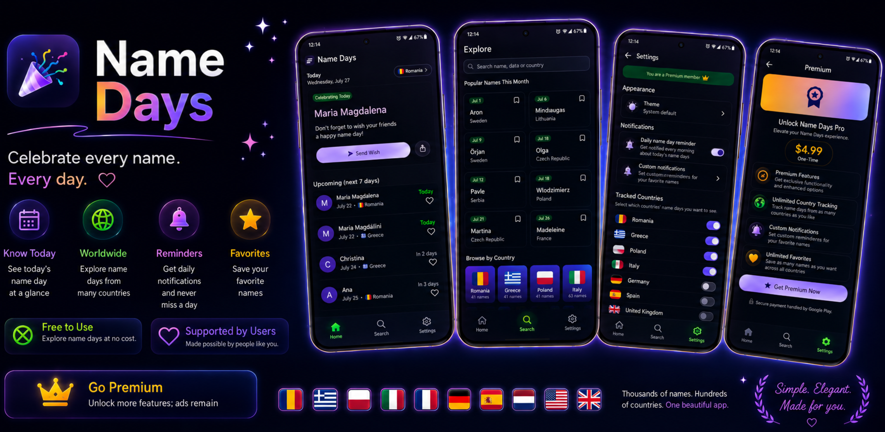

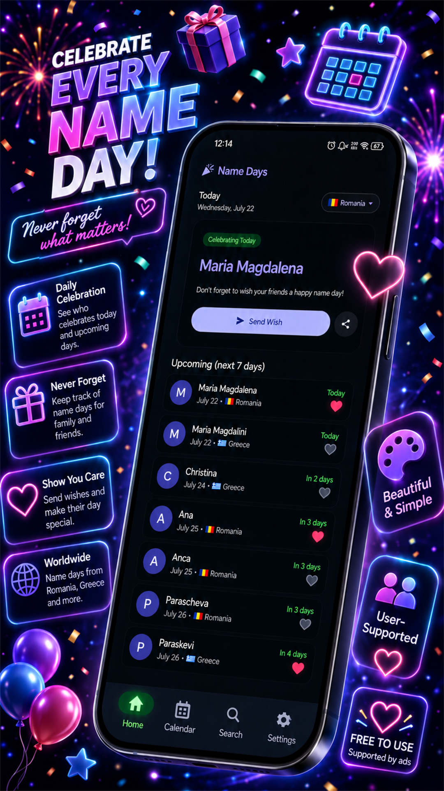
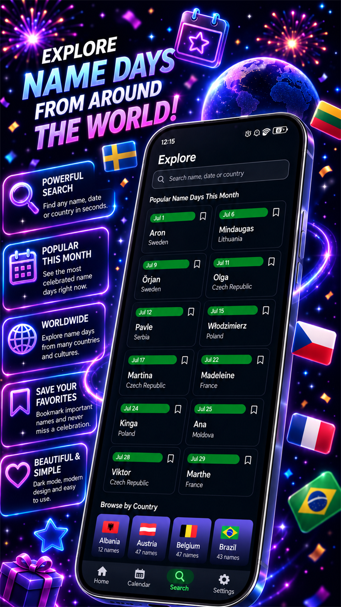
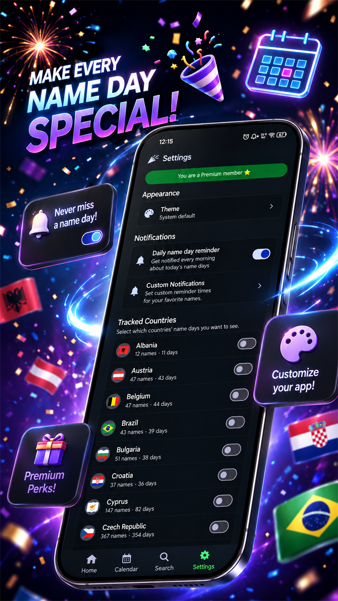
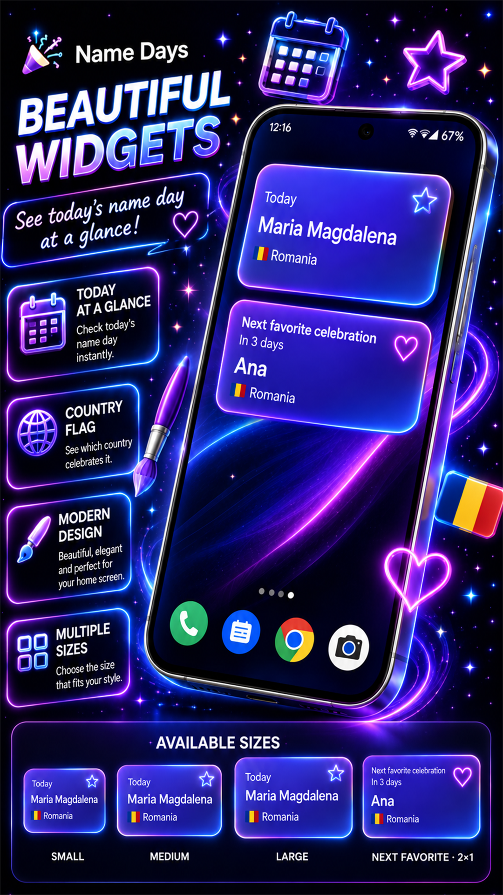
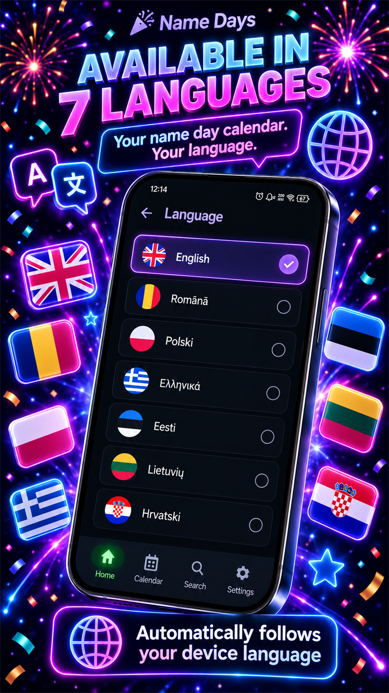
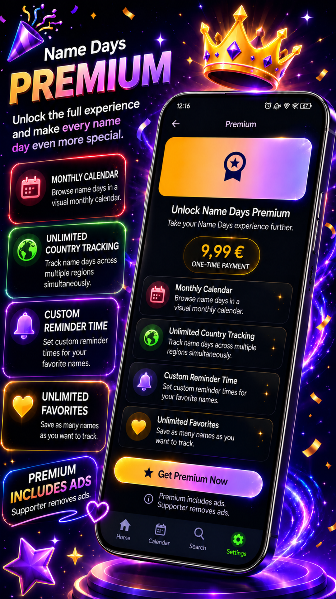

---

## 📅 About Name Days

**Name Days** is a name-day calendar for Romania and many other local traditions.
Discover today's celebrations, search names and dates, save favorites, track
countries, and receive optional daily reminders — in a friendly Android interface.

Name-day calendars are **bundled with the app**. Calendar lookup, search,
favorites, widget content and reminders are processed on your device.

> ### 🔔 Free App — Supported by Advertising
> Name Days is free and funded by **Google AdMob** advertising.  
> **One-Time Supporter** removes ads while its entitlement remains valid.  
> **Monthly Supporter** removes ads while the subscription is active.  
> **Premium Lifetime unlocks features — it does not remove ads.**  
> There is no monthly Premium subscription in this app.

Interstitial ads are shown only after user navigation: at least six qualifying
actions, with at least **120 seconds after the previous interstitial closes**.
An ad is requested only near that threshold and after the cooldown; failed
requests are not retried for 120 seconds. Interstitials do not show on launch.

---

## ✨ Features

### 🗓️ Today's Celebrations
- Today's name days at a glance
- Country selection with familiar flags
- Automatically follows the current date
- Local calendar data available without an account

### 🌍 Local Traditions
Explore Romanian, Greek, Polish, Hungarian, Italian, Spanish, Swedish,
Finnish, Ukrainian and many other name-day calendars.

> Traditions can differ by country, region, denomination, source and year.
> Calendar information is cultural and informational, not a guarantee of completeness.

### 📱 Home Screen Widget

| Option | Description |
|---|---|
| **Today's names** | See today's celebrations without opening the app |
| **Resizable** | Resize the widget using your Android launcher |
| **Colors** | Indigo, green or dark backgrounds |
| **Text size** | Small, medium or large name text |
| **Country label** | Show or hide the country |
| **Preview** | Widget-picker previews for older and newer Android versions |

Customize from **Settings → Customize home screen widget**.
Changes apply to all Name Days widgets; the country follows your app selection.
Launcher appearance and available sizes may vary by device.

### 🔔 Daily Reminders
- Optional local name-day notification
- Reminders generated on the device, not a developer-operated reminder server
- Custom reminder time with Premium Lifetime
- Notification permission and battery-reliability guidance

> Notification availability depends on device permissions and settings.

### 🔎 Additional Features
- **Search** by name, date or country
- **Favorite names** and upcoming celebrations
- **Tracked countries** for the traditions you follow
- **Light and dark themes**
- **Easy sharing** with family and friends

---

## 👑 Premium Features

| Feature | Free | Premium Lifetime |
|---|:---:|:---:|
| Today's name days and search | ✅ | ✅ |
| Favorites and country tracking | ✅ Limited | ✅ Unlimited |
| Home screen widget and customization | ✅ | ✅ |
| Daily reminders | ✅ | ✅ |
| **Custom daily reminder time** | ❌ | ✅ |
| **Removes advertising** | ❌ | ❌ |

> **Premium Lifetime still includes ads.** Ad removal is a separate Supporter benefit.

---

## 💳 Pricing

Name Days is **free** and supported by Google AdMob advertising.  
All paid tiers are optional. Google Play displays current prices, taxes,
currency and availability before you confirm a purchase.

### One-Time Purchases

| Product | Price | Description |
|---|:---:|---|
| 💎 **Premium Lifetime** | Shown in Google Play | Unlimited tracked countries and favorites; custom reminder time. **Ads are still shown.** |
| ❤️ **One-Time Supporter** | Shown in Google Play | **Removes all in-app advertising** while the entitlement remains valid. Supporter badge. Does not unlock Premium feature limits. |

### Subscriptions

| Product | Price | Benefits |
|---|:---:|---|
| ❤️ **Monthly Supporter** | Shown in Google Play | **Removes all in-app advertising while active**, Monthly Supporter badge and eligible exclusive launcher icons. Does not unlock Premium feature limits. |

> Refunds, revocations or subscription expiration can restore ads once the updated
> entitlement is verified. Cancellation normally keeps benefits until the paid period ends.
> Premium Lifetime does not mark Supporter products as owned or cancel Monthly Supporter.

---

## 🛡️ Privacy

Name Days keeps its calendar features local and makes advertising choices available:

| | |
|---|---|
| 🔔 | Google AdMob adaptive banner, native, interstitial and app-open ads |
| ✅ | UMP consent checks before ad requests; privacy options in Settings where required |
| ✅ | One-Time Supporter and active Monthly Supporter remove ads |
| ❌ | Premium Lifetime does not remove ads |
| ✅ | No Mobile Ads SDK initialization at startup when a valid ad-removal entitlement is already recognized |
| ✅ | No further app-managed ad requests or displays after ad removal becomes active |
| ❌ | Core features do not read contacts or request precise GPS location |
| ✅ | Calendars, favorites, reminders and widget preferences are handled locally |
| ✅ | Purchases managed by Google Play and RevenueCat |

AdMob may process advertising identifiers, IP-derived approximate location,
interactions and diagnostics. Personalized, non-personalized or limited ads
depend on applicable privacy choices and Google's configuration.

→ **[Full Privacy Policy](./PRIVACY_POLICY.md)**

---

## 🔗 Download

**[Name Days on Google Play](https://play.google.com/store/apps/details?id=com.namedaysdc)**

---

## 🌍 Calendar Information

Name-day traditions vary by region and source. The app bundles country calendars
for local lookup; availability and entries may change as calendars are corrected.
Found a wrong name or date? Include the country, date and a reliable source in a
[bug report](https://bugs.rdcapps.com).

---

## 📱 Tablet Screenshots

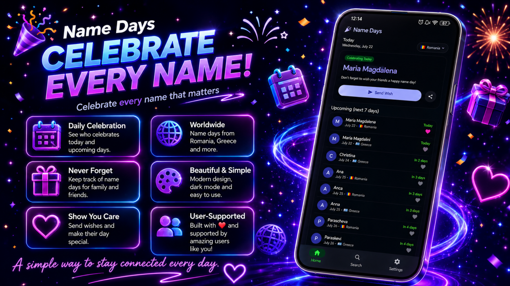
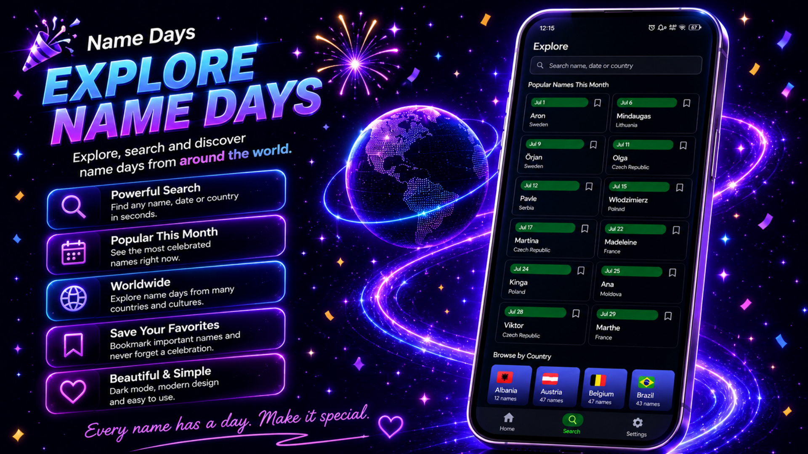
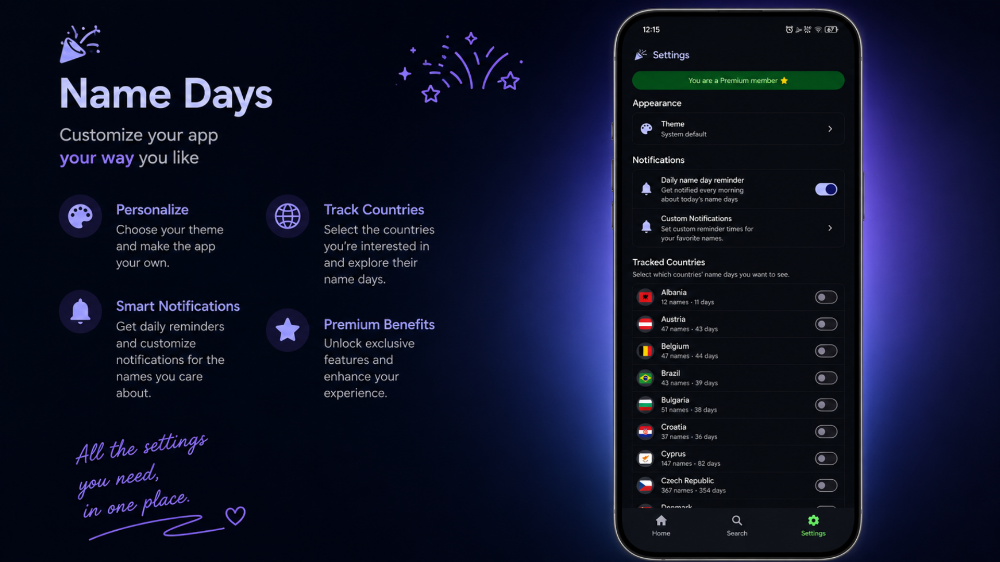
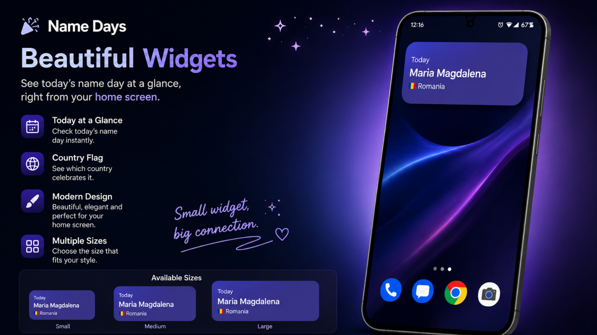
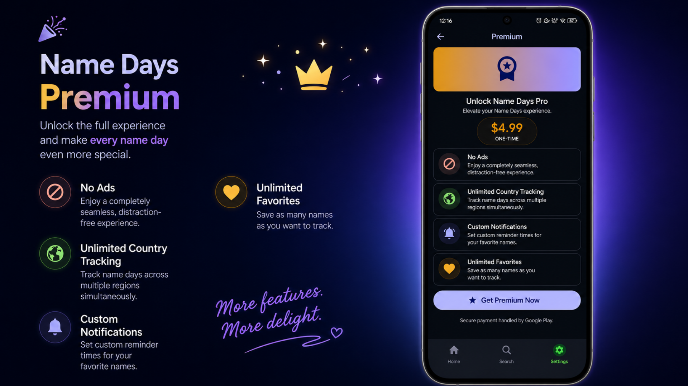

---

## 📄 Legal Documents

Published pages: [Privacy Policy](https://policy.rdcapps.com/namedays.html) ·
[Terms of Use](https://terms.rdcapps.com/namedays.html) ·
[Bug reports](https://bugs.rdcapps.com/).

| Document | Description |
|---|---|
| [Privacy Policy](./PRIVACY_POLICY.md) | Local data, purchases, AdMob and privacy choices |
| [Terms of Use](./TERMS_OF_SERVICE.md) | Rules for using Name Days |
| [License](./LICENSE) | Proprietary software license |
| [Security Policy](./SECURITY.md) | How to report vulnerabilities |
| [Changelog](./CHANGELOG.md) | Version history |
| [Support](./SUPPORT.md) | Help and contact information |

---

## 👤 Developer

**Denis Casian** — Independent developer, Romania 🇷🇴

| | |
|---|---|
| 🌐 Website | [rdcapps.com](https://rdcapps.com/) |
| 📧 Support | [support@rdcapps.com](mailto:support@rdcapps.com) |
| 🐛 Bug Reports | [bugs.rdcapps.com](https://bugs.rdcapps.com) |
| 📱 App | [Name Days on Google Play](https://play.google.com/store/apps/details?id=com.namedaysdc) |

---

Made with ❤️ for local traditions around the world.

**[Download Name Days](https://play.google.com/store/apps/details?id=com.namedaysdc)** ·
**[Privacy Policy](./PRIVACY_POLICY.md)** ·
**[Terms of Use](./TERMS_OF_SERVICE.md)**

*© 2026 Name Days. All rights reserved.*

